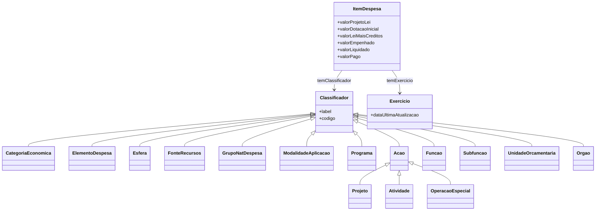

# LOA - Ontologia do Orçamento Federal Brasileiro

!!! success "Versão Estável"
    Modelo ontológico da classificação da despesa do orçamento federal brasileiro.

## Apresentação

Um movimento no campo democrático, em escala mundial, vem afetando positivamente a administração pública nos últimos tempos. Trata-se dos esforços em atender à maior demanda por transparência e pelo acesso às informações de interesse geral por parte do cidadão, produzidas pelo governo.

Este movimento ensejou, aqui no Brasil, o Plano de Ação Nacional sobre Governo Aberto (Decreto de 15 de setembro de 2011) e a assinatura da Parceria para Governo Aberto (PGA).

Como parte destes esforços, a Secretaria de Orçamento Federal apresenta o **Projeto "Orçamento Federal em Formato Aberto"**, com a publicação dos dados da despesa do Orçamento Geral da União no padrão de dados abertos RDF.

## Namespace URI

```
http://vocab.e.gov.br/2013/09/loa
```

## Autoria

- [Secretaria de Orçamento Federal - SOF](https://www.portalsof.planejamento.gov.br/)

## Formatos Disponíveis

| Formato | Descrição | Download |
|---------|-----------|----------|
| OWL/XML | Web Ontology Language | [loa.owl](../data/loa.owl) |

## O Modelo Ontológico

### Classes Principais



### Descrição das Classes

| Classe | Descrição | Referência MTO |
|--------|-----------|----------------|
| `Classificador` | Classe base para classificações | - |
| `CategoriaEconomica` | Categoria Econômica | MTO 2013 |
| `ElementoDespesa` | Elemento de Despesa | MTO 2013 |
| `Esfera` | Esfera orçamentária | MTO 2013 |
| `Exercicio` | Exercício Financeiro | MTO 2013 |
| `FonteRecursos` | Fonte de Recursos | MTO 2013 |
| `GrupoNatDespesa` | Grupo de Natureza da Despesa (GND) | MTO 2013 |
| `ItemDespesa` | Item de Despesa (linha do orçamento) | - |
| `Subtitulo` | Subtítulo (Localizador do gasto) | MTO 2013 |
| `ModalidadeAplicacao` | Modalidade de Aplicação | MTO 2013 |
| `Programa` | Programa | MTO 2013 |
| `Acao` | Ação | MTO 2013 |
| `Projeto` | Projeto (subclasse de Ação) | MTO 2013 |
| `Atividade` | Atividade (subclasse de Ação) | MTO 2013 |
| `OperacaoEspecial` | Operação Especial (subclasse de Ação) | MTO 2013 |
| `PlanoOrcamentario` | Plano Orçamentário | MTO 2013 |
| `Funcao` | Função | MTO 2013 |
| `Subfuncao` | Subfunção | MTO 2013 |
| `UnidadeOrcamentaria` | Unidade Orçamentária (UO) | MTO 2013 |
| `Orgao` | Órgão | MTO 2013 |
| `IdentificadorUso` | Identificador de Uso (IDUSO) | MTO 2013 |
| `ResultadoPrimario` | Identificador de Resultado Primário | MTO 2013 |

## Propriedades

### Object Properties

| Propriedade | Domínio | Range | Descrição |
|-------------|---------|-------|-----------|
| `temExercicio` | ItemDespesa | Exercicio | Relaciona item ao exercício fiscal |
| `temClassificador` | ItemDespesa | Classificador | Super-propriedade de classificadores |
| `temAcao` | ItemDespesa | Acao | Relaciona à ação |
| `temCategoriaEconomica` | ItemDespesa | CategoriaEconomica | Relaciona à categoria |
| `temElementoDespesa` | ItemDespesa | ElementoDespesa | Relaciona ao elemento |
| `temEsfera` | ItemDespesa | Esfera | Relaciona à esfera |
| `temFonteRecursos` | ItemDespesa | FonteRecursos | Relaciona à fonte |
| `temFuncao` | ItemDespesa | Funcao | Relaciona à função |
| `temGnd` | ItemDespesa | GrupoNatDespesa | Relaciona ao GND |
| `temOrgao` | UnidadeOrcamentaria | Orgao | Relaciona UO ao órgão |
| `temPrograma` | ItemDespesa | Programa | Relaciona ao programa |

### Datatype Properties

| Propriedade | Tipo | Descrição |
|-------------|------|-----------|
| `valorProjetoLei` | decimal | Valor do PLOA |
| `valorDotacaoInicial` | decimal | Valor da LOA (Dotação Inicial) |
| `valorLeiMaisCreditos` | decimal | Valor LOA + Créditos (Dotação Atual) |
| `valorEmpenhado` | decimal | Valor Empenhado |
| `valorLiquidado` | decimal | Valor Liquidado |
| `valorPago` | decimal | Valor Pago |

## Dados Históricos

Os dados do orçamento federal em RDF estavam disponíveis para download:

| Exercício | Período |
|-----------|---------|
| LOA 2014 | 2014 |
| LOA 2013 | 2013 |
| LOA 2012 | 2012 |
| LOA 2011 | 2011 |
| LOA 2010 | 2010 |
| LOA 2009 | 2009 |
| LOA 2008 | 2008 |
| LOA 2007 | 2007 |
| LOA 2006 | 2006 |
| LOA 2005 | 2005 |
| LOA 2004 | 2004 |
| LOA 2003 | 2003 |
| LOA 2002 | 2002 |
| LOA 2001 | 2001 |
| LOA 2000 | 2000 |

## Referências

- [Manual Técnico de Orçamento - MTO](http://www.orcamentofederal.gov.br/)
- [Portal SOF](https://www.portalsof.planejamento.gov.br/)
